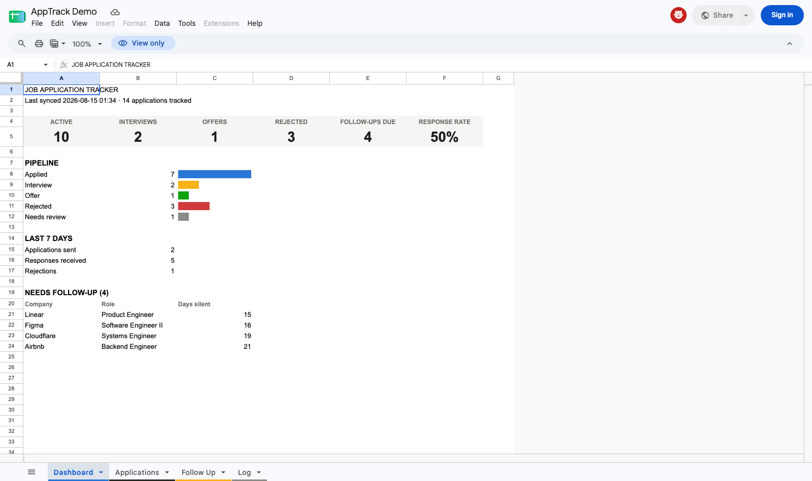
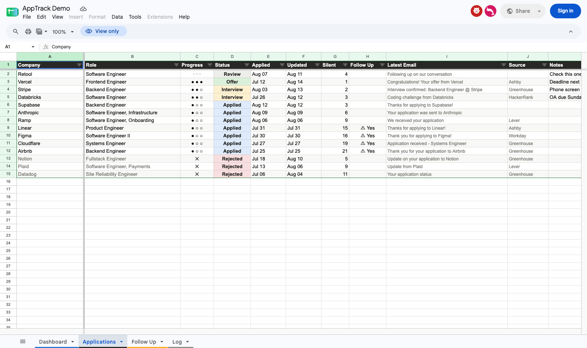
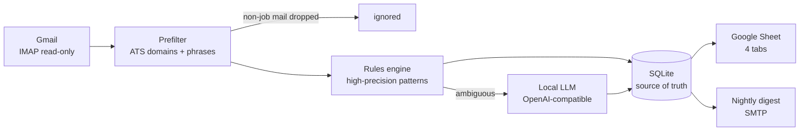

# AppTrack 📬

**Never miss a job-application email again.** AppTrack reads your Gmail every
night (read-only), finds the emails about *your* job applications — confirmations,
rejections, interview invites, offers — and turns them into a clean Google Sheet
dashboard plus a nightly digest email that tells you exactly who to follow up with.

Everything runs on your own hardware. The optional LLM fallback is a local model
(llama.cpp / Ollama / vLLM — anything OpenAI-compatible); no email content ever
leaves your machine except the rows you choose to mirror into your Google Sheet.

## Screenshots

| Dashboard | Applications |
|---|---|
|  |  |

*(Demo data — [view the live demo sheet](DEMO_SHEET_URL))*

## How it works



1. **Fetch** — incremental UID-based IMAP fetch from `[Gmail]/All Mail`
   (archived mail included, Spam/Trash excluded). First run backfills
   `BACKFILL_DAYS` (default 30); after that only new mail is read.
2. **Prefilter** — a local allowlist of ~50 ATS sender domains (Greenhouse,
   Lever, Workday, Ashby, iCIMS…) plus job-phrase patterns decides whether an
   email is even a candidate. Job-alert newsletters, package notifications, and
   "application received" emails about *insurance or leases* are filtered out.
   Everything non-job is ignored and never stored or sent to the LLM.
3. **Classify** — high-precision regex rules handle the obvious cases
   ("thank you for applying" → APPLIED, "move forward with other candidates" →
   REJECTED, "schedule your interview" → INTERVIEW, "pleased to extend an
   offer" → OFFER). Anything ambiguous goes to your local LLM for structured
   extraction; if that fails too, the email lands in **NEEDS_REVIEW** instead
   of being guessed at.
4. **Track** — emails are linked to applications by Gmail thread, then by
   normalized company + token-based role matching. SQLite is the source of
   truth; the sheet is a view.
5. **Publish** — four sheet tabs (Dashboard / Applications / Follow Up / Log)
   and a digest email listing new activity and every application that's gone
   silent past `FOLLOWUP_DAYS`.

## Status model & edge cases

- `APPLIED → INTERVIEW → OFFER` — status only ever advances, so a late
  "thanks for applying" email can't demote an application you're interviewing for.
- `REJECTED` is terminal for that row. If the company comes back later —
  you re-apply, or a recruiter revives your application — a **fresh row** is
  created instead of resurrecting the closed one.
- **Multiple roles at one company** are separate rows. Role matching is
  token-based: "Software Engineer - Backend" and "Software Engineer, Backend"
  merge, but "Backend Engineer" vs "Data Engineer" and "SWE I" vs "SWE III"
  stay separate.
- A rejection with **no parseable role** attaches to the application on the
  same ATS platform when there are several live roles at one company.
- `NEEDS_REVIEW` means the pipeline refused to guess — check that email yourself.
- Company-name variants ("Ramp" vs "Ramp Financial, Inc.") are normalized so
  they don't create duplicates.
- AppTrack's own digest emails are recognized and never classified.

## The sheet

- **Dashboard** — headline stat tiles (active / interviews / offers / rejected /
  follow-ups due / response rate), a pipeline bar breakdown, last-7-days
  activity, and your top follow-ups.
- **Applications** — every application with a visual progress column
  (`● ● ○` = interview stage, `✕` = rejected), status chips, days-silent
  counter, and a **Notes** column that's yours: manual edits survive every
  rewrite (keyed by a hidden `app_id` — don't edit that one).
- **Follow Up** — applications past the follow-up threshold, most-silent first.
- **Log** — one row per sync run.

## Setup

You'll need: a Gmail account with 2-Step Verification, Docker, and ~15 minutes.

### 1. Gmail app password

Google Account → Security → 2-Step Verification → **App passwords** → create
one for "Mail". Remove the spaces when copying it.

### 2. Google service account (no OAuth browser flow)

1. [console.cloud.google.com](https://console.cloud.google.com) → create a project
2. APIs & Services → enable the **Google Sheets API**
3. IAM & Admin → Service Accounts → **Create service account**
   (skip both optional permission steps — it needs no project roles)
4. Open the account → Keys → Add key → **JSON** → download →
   save as `secrets/service-account.json`

### 3. The sheet

Create an empty Google Sheet, copy its ID from the URL
(`docs.google.com/spreadsheets/d/`**`<SHEET_ID>`**`/edit`), and share the sheet
(**Editor**) with the service account's `client_email` from the JSON file.

### 4. Configure & run

```bash
cp .env.example .env    # fill in GMAIL_ADDRESS, GMAIL_APP_PASSWORD, SHEET_ID
docker compose build
docker compose run --rm apptrack sync   # first run: backfill, watch the logs
docker compose up -d                    # nightly scheduler from here on
```

### Local LLM (optional but recommended)

Any OpenAI-compatible endpoint works — llama.cpp `llama-server`, Ollama, vLLM,
LM Studio. A 7B instruct model (e.g. Qwen 2.5 7B) handles this task well.
Point `LLM_BASE_URL` at it and set `LLM_DOCKER_NETWORK` to the docker network
the LLM container lives on.

**No GPU? No problem:** set `LLM_ENABLED=0`. The rules engine still catches the
vast majority of ATS email; ambiguous emails are marked NEEDS_REVIEW for you to
check by hand instead of being sent to a model.

## Configuration reference

| Variable | Default | Purpose |
|---|---|---|
| `GMAIL_ADDRESS` | — | your Gmail address |
| `GMAIL_APP_PASSWORD` | — | app password (never your real password) |
| `SHEET_ID` | — | target Google Sheet |
| `GOOGLE_SA_JSON` | `/secrets/service-account.json` | service-account key path in container |
| `LLM_ENABLED` | `1` | `0` = rules-only, no LLM calls at all |
| `LLM_BASE_URL` | `http://llama:8080/v1` | OpenAI-compatible endpoint |
| `LLM_MODEL` | `qwen2.5-7b` | model name passed to the endpoint |
| `LLM_DOCKER_NETWORK` | `bridge` | external docker network the LLM is on |
| `FOLLOWUP_DAYS` | `14` | silence threshold before flagging follow-up |
| `DIGEST_TO` | `GMAIL_ADDRESS` | digest recipient |
| `SYNC_HOUR` | `2` | nightly run hour (local time, `TZ`) |
| `BACKFILL_DAYS` | `30` | how far the first run looks back |

## Commands

```bash
docker compose run --rm apptrack sync            # manual sync now
docker compose run --rm apptrack sync --no-email # sync without digest
docker compose run --rm apptrack sheet           # rewrite sheet from DB
docker compose run --rm apptrack digest          # resend digest
docker compose logs -f apptrack                  # watch the scheduler
```

## Privacy & safety

- IMAP access is strictly **read-only**: nothing is marked read, labeled, or deleted.
- Email bodies are processed in memory; only application metadata (company,
  role, status, subject line) is stored in SQLite and mirrored to your sheet.
- The LLM only ever sees emails that already passed the job-related prefilter,
  and it's your own local model.
- Secrets live in `.env` and `secrets/` — both gitignored.

## Development

```bash
python3 -m venv .venv && .venv/bin/pip install -e ".[dev]"
.venv/bin/python -m pytest      # 43 tests incl. real-world regression fixtures
```

The test suite doubles as the tuning loop: every misclassification found in
real inboxes becomes a fixture in `tests/` before the fix lands.

## License

MIT
